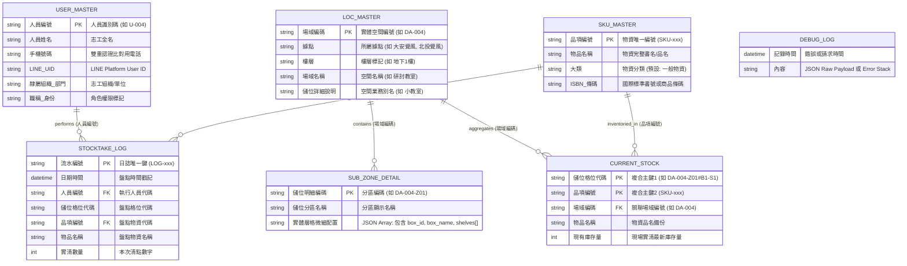

### 一、 瞭解您的要求

我們將針對已上傳的 `1_Config.js`、`2_Main.js`、`3_Controllers.js`、`4_Database.js`、`5_FlexTemplates.js`、`appsscript.json` 與 `.clasp.json` 等完整專案代碼進行深度反向工程（Reverse Engineering）。

* **分析目標**：解析底層 Google Sheets 資料庫關聯模型、LINE Bot 狀態機流轉邏輯、模式 1 獨立格位庫存更新、雙重實名認證機制與容錯更正閉環[cite: 1, 4, 6]。
* **交付規範**：輸出包含 `<project_context>`、`<database_schema>`（Mermaid ER Diagram）、`<business_rules>`、`<user_scenarios>`（Gherkin 語法）與 `<coding_standards>` 的結構化開發規範與情境模板。


---

### 二、 系統反向工程標準規格文件

```markdown
<project_context>
- 核心技術棧：
  * Runtime Environment: Google Apps Script (GAS) - V8 Engine [appsscript.json]
  * Interface: LINE Messaging API (Flex Message, Reply API, Push Image/Text) [1_Config.js, 5_FlexTemplates.js]
  * Database: Google Sheets Spreadsheet API (SpreadsheetApp) [4_Database.js]
  * Session Cache: Google Apps Script CacheService (UserCache, TTL 1200s ~ 1800s) [2_Main.js]
  * Deployment & Tooling: @google/clasp + Git / GitHub [appsscript.json, .clasp.json]
- 架構分層規範：
  * 1_Config.js: Global Configurations, Constant Definitions, GitHub Raw Asset CDN URLs [1_Config.js]
  * 2_Main.js: Webhook Entry Point (doPost) & Finite State Machine (FSM) Dispatcher [2_Main.js]
  * 3_Controllers.js: Navigation Flow, System Command Handlers, Rollback Controllers [3_Controllers.js]
  * 4_Database.js: Data Access Layer (DAL), Business Validation, Atomic Upsert & Logging [4_Database.js]
  * 5_FlexTemplates.js: Presentation Layer (LINE Flex Bubble/Carousel UI Components & Transport) [5_FlexTemplates.js]
- 狀態管理與命名風格：
  * 狀態命名：全大寫蛇形前綴（如 `STATE_CHOOSE_SITE`, `STATE_INPUT_QTY`, `STATE_POST_STOCKTAKE`）[2_Main.js]
  * 系統指令命名：`CMD_` 前綴（如 `CMD_EXIT_STOCKTAKE`, `CMD_START_CORRECTION`）[1_Config.js]
  * 識別碼編碼規範：
    - 場域編碼：`{據點代碼}-{編號}`（如 `DA-004`）[1, 4_Database.js]
    - 儲位分區代碼：`{場域編碼}-Z{序號}`（如 `DA-004-Z01`）[1]
    - 實體微細格位代碼：`{儲位分區代碼}#{櫃號}-{層號}`（如 `DA-004-Z01#B1-S1`）[1]
    - 品項編號：`SKU-` + 3 位補零流水號（如 `SKU-001`）[4_Database.js]
    - 流水日誌編號：`LOG-` + 3 位補零流水號（如 `LOG-001`）[4_Database.js]
</project_context>

<database_schema>


</database_schema>

<business_rules>

1. 身份認證與綁定規則 (Dual Authentication & RBAC)：
* 任何進線 LINE_UID 必須先存在於 `USER_MASTER` 且欄位值不為空，否則強制攔截進入認證狀態機 [2_Main.js, 4_Database.js]。
* 認證採「姓名精確比對」+「手機號碼末 4 碼或 10 碼全碼比對」雙重校驗 [4_Database.js]。
* 若帳號已被其他 `LINE_UID` 綁定，系統阻斷綁定並提示管理員處理 [4_Database.js]。
* 認證成功後將 `LINE_UID` 固化寫入 `USER_MASTER`，移除 Session 暫存，開放盤點權限 [2_Main.js, 4_Database.js]。


2. 模式 1 獨立格位庫存更新規則 (Multi-location Isolation Rule)：
* 庫存唯一定位基準為 `[儲位格位代碼 (cell_code)] + [品項編號 (sku_id)]` 複合鍵 [4_Database.js]。
* 同一品項若存放於多個不同格位（如 B1-S1 與 B4-S2），更新其中一個格位僅覆寫該格位的 `CURRENT_STOCK.現有庫存量`，絕不影響其他格位之現有庫存量 [4_Database.js]。
* 每次庫存更新皆觸發日誌新增：於 `STOCKTAKE_LOG` 新增一筆審計紀錄（Append-only）[4_Database.js]。


3. SKU 自動查重建檔規則 (Idempotent SKU Creation)：
* 搜尋物品輸入無相符項目時，志工可選擇自訂品名或關鍵字建檔 [2_Main.js]。
* 建檔前執行全形半形去除與大小寫正規化查重比對 [4_Database.js]。
* 若比對已存在同名 SKU，直接返回既有 `sku_id`，不重複建立；若不存在，自動派發 `SKU-` + 3 位流水號 [4_Database.js]。


4. 容錯與即時更正補救機制 (Undo / Correction Mechanism)：
* 盤點成功後提供補救入口 `CMD_START_CORRECTION` [3_Controllers.js, 5_FlexTemplates.js]。
* 修改品名：同步更新 `SKU_MASTER`、`STOCKTAKE_LOG` 最後一筆與 `CURRENT_STOCK` [4_Database.js]。
* 修改數量：同步覆寫 `STOCKTAKE_LOG` 最後一筆與 `CURRENT_STOCK` [4_Database.js]。
* 刪除紀錄：刪除 `STOCKTAKE_LOG` 最後一筆，並從 `CURRENT_STOCK` 刪除該格位物資列 [4_Database.js]。
* 更正成功後需推播小和尚插圖與溫馨提示 [5_FlexTemplates.js]。


5. 狀態機與生命週期規則 (FSM & Session Rule)：
* Session 快取存活時間為 1200 ~ 1800 秒，逾時自動重置回初始選擇據點狀態 [2_Main.js]。
* 任何階層點擊 `CMD_EXIT_STOCKTAKE`，系統必須發送 `finish.png` 結束圖卡並立即調用 `cache.remove(lineUid)` 清空會話 [2_Main.js, 5_FlexTemplates.js]。
* 各選單皆須配備 `↩️ 返回` 上一層機制，狀態由下而上回退：`CELL -> BOX -> ZONE -> LOC -> FLOOR -> SITE` [2_Main.js, 3_Controllers.js]。
</business_rules>


<user_scenarios>
Feature: 覺風物資盤點與庫存管理系統

Scenario: 志工初次實名雙重認證成功 (Happy Path)
Given 志工的 LINE UID 尚未綁定在 USER_MASTER
When 志工在對話框發送任何文字訊息
Then 系統回應要求輸入【人員姓名】並進入 STATE_BINDING_NAME 狀態
When 志工輸入 "寬粉"
Then 系統提示輸入【手機號碼】末 4 碼並進入 STATE_BINDING_PHONE 狀態
When 志工輸入 "5678"
Then 系統核對 USER_MASTER 姓名與電話相符
And 將該 LINE UID 寫入 USER_MASTER
And 回應 "志工身份認證成功！已為您開通盤點權限"

Scenario: 依五層階層導航定位格位並完成盲盤登記 (Happy Path)
Given 志工已完成身份認證
When 志工點擊 "📷 開始盤點"
Then 系統列出所有據點大字卡片並附帶「結束盤點」按鈕
When 志工依序點選 "大安覺風" -> "地下1樓" -> "小教室" -> "B2-第2櫃" -> "第2櫃-第3層(中下)"
Then 系統鎖定格位代碼 "DA-004-Z01#B2-S3" 並提示輸入物品名稱
When 志工輸入 "法華經入門"
Then 系統命中 1 筆物資並彈出確認卡片
When 志工點擊 "👌 確認是此物品"
Then 系統提示輸入實清數量
When 志工輸入數字 "10"
Then 系統於 STOCKTAKE_LOG 新增流水紀錄
And 於 CURRENT_STOCK 獨立更新該格位庫存為 10
And 彈出盤點成功導航卡片

Scenario: 盤點完成後即時更正數量 (Edge Case - Correction)
Given 志工剛完成 "DA-004-Z01#B2-S3" 的 "法華經入門" 數量 10 之登記
And 系統停留在 STATE_POST_STOCKTAKE 狀態
When 志工點擊 "✏️ 剛才打錯了？立即更正"
Then 系統彈出更正選單卡片
When 志工點擊 "🔢 更正實清數量 (算錯本數)"
Then 系統提示輸入正確的實清數量數字
When 志工輸入 "8"
Then 系統覆寫 STOCKTAKE_LOG 最後一筆實清數量為 8
And 覆寫 CURRENT_STOCK 該格位現有庫存量為 8
And 發送小和尚盤點中圖片 (monk_stocktake.png)
And 附帶提示 "🙏 實清數量已更正為【8 本/套】！下次盤點要再多加小心確認喔～😊"

Scenario: 搜尋未知物品自訂規格建檔 (Edge Case - New SKU)
Given 志工已鎖定格位代碼 "DA-004-Z01#B1-S1"
When 志工輸入不存在之物品名稱 "金剛經講記-精裝版"
Then 系統判定無相符物資並彈出建檔選擇卡片
When 志工點擊 "✏️ 自訂輸入完整品名規格"
Then 系統進入 STATE_INPUT_FULL_SKU_NAME 狀態並提示輸入完整名稱
When 志工輸入 "金剛經講記-精裝紀念版"
Then 系統於 SKU_MASTER 新增一列並產生新編號 "SKU-095"
And 自動將狀態切換至 STATE_INPUT_QTY 提示輸入數量

Scenario: 志工主動結束盤點安全退出 (Happy Path)
Given 志工處於任何盤點或選單狀態
When 志工點擊 "🚪 結束盤點 (回主選單)" 或發送 "結束盤點"
Then 系統清除 CacheService 中的會話狀態
And 發送 finish.png 結束盤點插圖
And 發送個人化感謝文字 "🙏 寬粉 您好，已為您安全結束本次盤點作業。"
</user_scenarios>

<coding_standards>

1. 防禦性編程與資料完整性保證：
* 禁用空指標直接存取：所有 Sheets 標題索引查詢必須檢查 `-1`，未找到欄位時拋出明確錯誤 [4_Database.js]。
* 複合主鍵防護：更新 `CURRENT_STOCK` 必須同時檢驗 `cell_code === rowCell && sku_id === rowSku`，避免跨儲位覆寫 [4_Database.js]。
* 外鍵一致性驗證：執行庫存寫入前，必須調用 `validateStocktakeRelations(userId, skuId)` 驗證人員與品項皆存在於主檔 [4_Database.js]。
* Webhook 冪等防護：攔截重複推播 `isRedelivery === true` 與無效 ReplyToken [2_Main.js]。


2. 模組化與作用域約束：
* 遵循 GAS 全域範疇特性，禁止模組間使用 ES6 `import / export` 或 Node `require` [1_Config.js, 2_Main.js]。
* 所有常數與指令集中於 `1_Config.js`，禁止在 Controller/UI 模組中寫死 Magic String [1_Config.js]。
* 跨模組資料傳遞一律使用序列化 JSON 物件存取 `CacheService` [2_Main.js]。


3. 長輩友善 UI/UX 設計標準：
* 按鈕文字長度限制：超過 20 字元時必須調用 substring 截斷並補 `...`，防止 LINE Flex 渲染破版 [5_FlexTemplates.js]。
* 視覺層級色彩標準：
* 主操作按鈕（確認、下一件）：綠色 `#16A34A` [5_FlexTemplates.js]
* 次要操作（同櫃換層）：藍色 `#2563EB` [5_FlexTemplates.js]
* 警示與更正：橘黃色 `#F59E0B` / 紅色 `#DC2626` [5_FlexTemplates.js]
* 返回與退出：灰白色次要按鈕 `style: secondary` [5_FlexTemplates.js]


* 全出口保證：所有選單卡片（含第 1 層據點選單）底部必須強制包含 `🚪 結束盤點 (回主選單)` [5_FlexTemplates.js]。
</coding_standards>


```

---

### 三、 導入與使用方式

1. **規格書固化**：此 Markdown 結構已精確對齊您當前生產環境（Production V2）的所有程式碼邏輯與資料庫規範[cite: 1, 3, 4, 5, 6, 7, 8]。
2. **未來 Vibe Coding 提示詞模板**：開啟新對話時，只需將上述內容直接提供給 AI，AI 即可 100% 精準繼承資料結構、狀態機及業務邊界[cite: 1]！

```